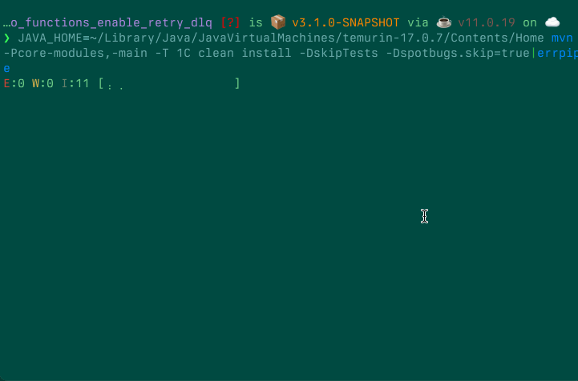

# errpipe

`<some long process>|errpipe [args]`

Simple command-line utility for piping logs to.

Built with [bubbletea](https://github.com/charmbracelet/bubbletea)

- Counts errors/warnings/info messages
- Live chart showing activity so you know when things are moving...
  - and an idle timer so you know when they're not
- Displays only errors by default. Info and warning level messages can be enabled with `-i` and `-w`, respectively
- Attempts to stop other processes by catching sigint and retransmitting it to the group (unix only, needs more testing)
- Prints a summary when complete

## Levels

You can enable warnings/info message display with `-w` and `-i` respectively

## Styles

errpipe supports several styles:

`ERRPIPE_STYLE=braille`

`ERRPIPE_STYLE=braille-line`

`ERRPIPE_STYLE=braille-4`[^1]

`ERRPIPE_STYLE=braille4-line`[^1]

`ERRPIPE_STYLE=block`

`ERRPIPE_STYLE=legacy`[^2]

`ERRPIPE_STYLE=legacy-block`[^2]

`ERRPIPE_STYLE=legacy-block-line`[^2]

[^1]: Braille4 characters may render strangely, depending on your OS' symbol font fallback.

[^2]: Requires a font that supports the [Symbols For Legacy Computing](https://en.wikipedia.org/wiki/Symbols_for_Legacy_Computing) Unicode block, or a suitable [fallback](https://github.com/dokutan/legacy_computing-font).