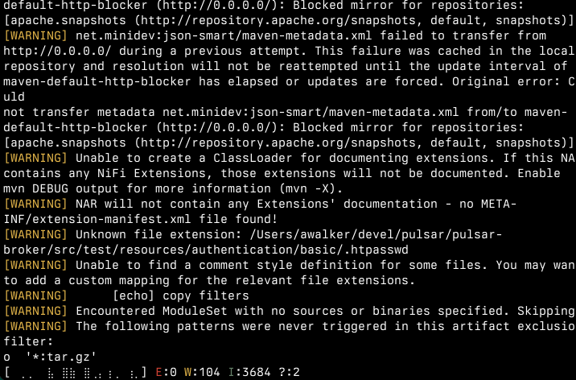

# errpipe

Simple command-line utility for piping logs to.

Built with [bubbletea](https://github.com/charmbracelet/bubbletea)

## Features
- Counts errors/warnings/info messages
- Live chart showing activity so you know when things are moving...
- And an idle timer so you know when they're not
- Live idle timer so you know when thingk
- Displays only errors by default. Info and warning level messages can be enabled with `-i` and `-w`, respectively
- Attempts to stop other processes by catching sigint and retransmitting it to the group (unix only, needs more testing)
- Prints a summary when complete

## Usage

`<some long process>|errpipe [args]`

